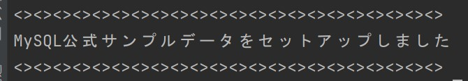
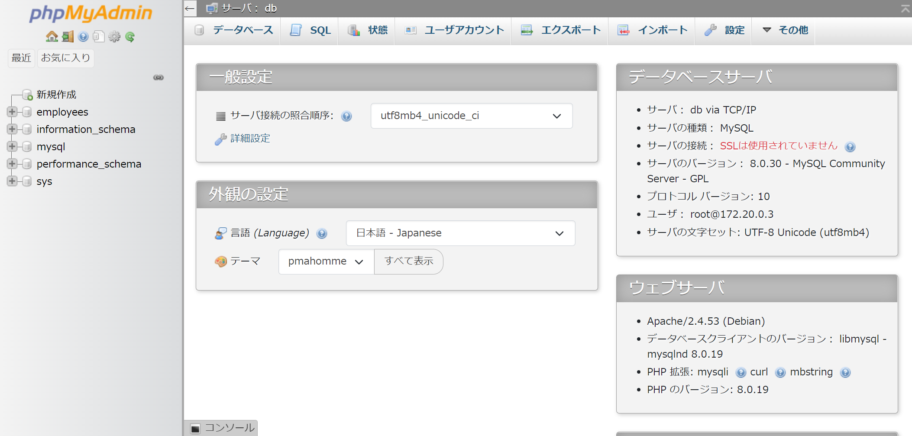

# MySQL版 本気の Docker サンプル

プログラミング学習をする上で環境構築は必要ではあるものの、Docker理解の優先度は低いです。  
学習者にとっては早くプログラミング学習に着手したいのに、環境構築でつまずいてしまいプログラミング学習時の苦手意識を植え付けてしまう大きな要因の１つとなっています。

ここ数日でそのような方を数人サポートした経緯もあり、本気のDockerサンプルシリーズを用意してみようと思いました。

## ご利用の際のお願い

ご利用の際にはTwitterのフォローをお願いします。  
[@tarotyjp (saburo)](https://twitter.com/tarotyjp)

また、ハッシュタグ `#本気のDockerサンプル` と [本気のDockerサンプル](https://github.com/tarotyjp/sample-series) のURLと一緒にツイートしていただけると嬉しいです。

ツイートサンプル（コピペOK）

```text
MySQL版 本気のDockerサンプル でプログラミング学習始めましたー
https://github.com/tarotyjp/sample-series

#本気のDockerサンプル
#駆け出しエンジニアとつながりたい 
#プログラミング初心者 
#プログラミング初学者と繋がりたい 
```

## 概要

このサンプルは「本気のDockerサンプルシリーズ」の一つです。  
本気のDockerサンプルシリーズの一覧は下記よりご確認ください。

- [本気のDockerサンプルシリーズ](https://github.com/tarotyjp/sample-series)

世界で一般的に利用されているRDBMSであるMySQLの学習に最適化したDockerサンプルです。  
このサンプルでは下記が利用できるようになっています。

- MySQLを利用した学習環境
- phpMyAdmin によるデータベースの利用

また、MySQLの公式サンプルデータを簡単にセットアップするシェルも用意してあります。

参考

- [Other MySQL Documentation(英語)](https://dev.mysql.com/doc/index-other.html)
- [今回利用するサンプルのGitHubリポジトリ(英語)](https://github.com/datacharmer/test_db)

シェルが実行されると下記の通りテーブルが作成されます。

| テーブル名                   | 説明          |
|:------------------------|:------------|
| departments             | 部署テーブル      |
| dept\_emp               | 所属テーブル      |
| dept\_manager           | 部署管理者中間テーブル |
| employees               | 社員テーブル      |
| salaries                | 給料テーブル      |
| titles                  | 役割テーブル      |

また、下記のようなビューも定義されています。  
ビューについて詳しくない方は、今時点特に気にしなくても構いません。

| ビュー名                    |
|:------------------------|
| current\_dept\_emp      |
| dept\_emp\_latest\_date |

### ご注意

MySQLの公式サンプルではありますが、テーブル設計のサンプルとしてではなく、データの参照、追加、更新、削除を練習するためのサンプルとして学習するようにしましょう。

また、このサンプルはWindows環境で作成しており、Macでの動作確認はしておりません。  
そのため、とくにM1/M2シリーズのMacではエラーが発生する可能性もあります。  

## 利用されるバージョン

このサンプルで利用しているバージョンは下記のとおりです。  
適宜 `Dockerfile` を修正して学習に併せたバージョンでご利用ください。

| 環境      | バージョン | 補足                                     |
|---------|-------|----------------------------------------|
| MySQL   | 8.0   | phpMyAdminを使うと便利です                     |

## 環境セットアップ

ダウンロードからコンテナの作成までの使い方について詳しく知りたい方は下記を参考に準備しましょう。  
その後こちらにもどり手順を確認してください。

[本気のサンプルシリーズの使い方](https://github.com/tarotyjp/sample-series/blob/main/manuals/download-docker.md)

リポジトリをクローンして下記を実行してください。  
パソコンのスペックにもよりますが、それぞれの実行には数分かかります。

```shell
docker compose up -d
docker compose exec db bash ./setup.sh
```

DBの接続に成功すれば下記のように表示されます。



## 環境を作り直したい時

---

**＊注意**  
こちらを実行するとデータベースに保存していた情報はすべて削除されます。  
SQLファイルなどの成果物は削除されません。

---

環境を作り直したい時のために全てを削除するシェルを作ってあります。

それぞれの環境に合わせて下記を実行し、前述の「環境セットアップ」を実行してください。

Windows

```
docker-down-all.bat
```

Mac

```
bash docker-down-all.sh
```

## 動作確認

### phpMyAdminの動作確認

下記にアクセスすることで動作確認できます。

[http://localhost:8000/index.php](http://localhost:8000/index.php)

下記画面が表示されれば動作確認OKです。


